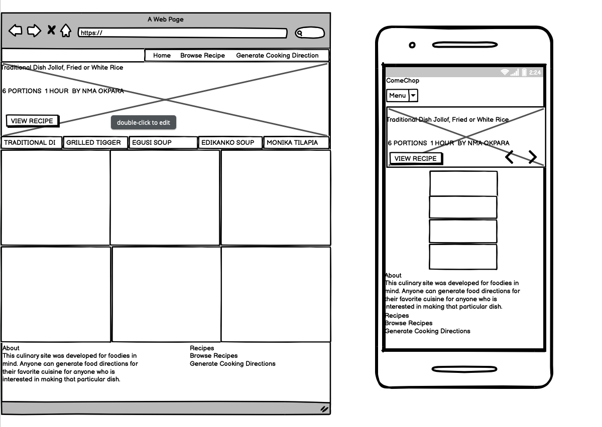

# Anthony Aneke's Code Institute Practical Python and Data-Centric Development Milestone Project 

## Introduction
The project milestone 3 is to employ Practical Python and Data-Centric Development created full-stack site that allows users to manage a common dataset about a particular domain. This milestone project gives two options:

1.	I created a culinary full stack site that allows users to share data with the community, and benefit from having convenient access to the data provided by other members.
2.	I have created a site that provides functionality, for any user. The site allows me the site owner to benefit from the collection of the dataset as a whole.

## Project Purpose
This full-stack culinary site was created for foodies in mind. The site allows users to manage a common dataset about a particular food domain where the user can generate food directions for their favorite cuisine for anyone who is interested in making that particular dish. The site is Unique, Viable in the real world and establishes a connection between the reader and the project to endear the reader to the project.

## UX design
In regard to UX design, I implemented the following: 
* Leveraged CSS and Bootstrap for Web and mobile first user experience.
* Used javascript and jQuery used to interaction of the webform i..e CREATE, READ, UPDATE, DELETE (CRUD) calls, input field validation, RESTful request (from the browser to the application server).

In the context of this Flask based application, I used flask to serve the endpoints needed to perform CRUD calls through RESTful requests on the MongoDB instance. 

Find wireframe from link below:



### User Stories

Important Notes: No authentication was expected for this project. The
focus is on the data, rather than any business logic, hence this feature was
not implemented. 

As a viewer aged between 13 years above, I want to 
1.	The ability to easily find and understand the controls for the application so that I can operate it easily.
2.	A large easy to press button and controls, so that regardless of the size of my finger I can use the application.
3.	The ability to choose from recipes uploaded by any user, so that I am about to replicate the cooking directions. 
4.	Visual icons and images that I recognize, so that I understand the recipe and cooking directions. 
5.	The ability to see author of the recipe.

As an author of the recipe, I want 
1.	A visually and operationally appealing site, so that I also have a positive experience when using the site.
2.	The ability to create, read, update, delete (CRUD) recipe and generate cooking directions. The prediction to update a record, the user has to perform a search for recipe category and ingredients. 
3.	The option to search an author or a recipe, but not easy for a child who is randomly pressing buttons to access, so that a profile is not deleted by accident.
4.	To know who made the cooking directions and how a user can contact them (feature to contact author not implemented in this version for the application).

Sprint planning: 
There 4 sprints for a during a 8 weeks project
•	I reviewed aspiration, goals and visions for the project
•	I accounted for information or updates that may impact the plan
•	Recorded issues and concerns (record feedback and discoveries)
•	Computed velocity and proposed velocity for each sprint 

## Suitability for purpose
This website design is suitable and appropriate to the user's demands. Please perform user stories above and wireframes.

## Navigation
This website design navigation links work correctly. The navigation bar was made sticky using CSS3 offering the options to stick to the top of the page as you scroll down.
This sticky property worked in accordance to design when it was tested on both chrome and safari.

## Ease of use
This website provides ease of use for its users/customers.

## Information Architecture
This website meets the standard structural and behavioral design criteria and is presented in an organized routine. Please refer to project goals and user stories.  

## Defensive Design 
The website 
# Layout and Visual Impact:
* Responsive Design –I used CSS to enable automated adjustments of screen sizes for multiple devices. I tested the site response in multiple simulated devices (tablets and mobile) and the site responded by adjusting its layout to the simulated screen sizes. Navbar on tablet resolutions was implemented in a similar fashion to Desktop for swift navigation. 
* Image Presentation - This website renders images, true to form and not small or stretched in anyway and meets the standard structural and behavioral design criteria and is presented in an organized routine. 
* Colour scheme and typography – The colour scheme on the website is consistent and does not hinder readability in any way. Primary action buttons have the same colour theme with the website.

# Software Development practices:
Directory Structure and File Naming – I went through systematic approach to develop a naming convention. After establishing this, I created html files for each website page as well as naming the pages to correspond to the top menu bar drop down. File naming and Directory structure are consistent to as seen in professional web development. 

## Version control
Git was used for version control. I incrementally and iteratively staged, committed, and pushed new or modified all changes during the implementation of this website/ Version control can make use of atomic commits and descriptive commit messages. To see iterative modifications and changes, see Git Hub.

## Testing implementation
I setup the Heroku platform to deploy the application and performed that served the webpages to be tested. I did static testing and visual inspection to make sure content was rendered as designed, I executed system testing to make sure user stories worked in accordance to design intent.  I used online html validators from w3.org for source code testing. The testing write-up leveraged user stories and as expected there were defects found during the testing cycle. 
Used the following validator site: https://validator.w3.org/

Here are the test results: 

Jollof Rice details page
------------------------
```
Warning: Section lacks heading. Consider using h2-h6 elements to add identifying headings to all sections.

From line 95, column 3; to line 95, column 55

ils --><section class="recipe-details" itemprop="nutrition">
```

Grilled Tiger Prawns details page
---------------------------------
```
Warning: Section lacks heading. Consider using h2-h6 elements to add identifying headings to all sections.

From line 95, column 3; to line 95, column 55

ils --><section class="recipe-details" itemprop="nutrition">
```

Nigerian Egusi Soup details page
--------------------------------
```
Warning: Section lacks heading. Consider using h2-h6 elements to add identifying headings to all sections.

From line 95, column 3; to line 95, column 55

ils --><section class="recipe-details" itemprop="nutrition">
```

Edikanikong details page
------------------------
```
Warning: Section lacks heading. Consider using h2-h6 elements to add identifying headings to all sections.

From line 95, column 3; to line 95, column 55

ils --><section class="recipe-details" itemprop="nutrition">
```

Monika Tilapia details page
---------------------------
```
Warning: Section lacks heading. Consider using h2-h6 elements to add identifying headings to all sections.

From line 95, column 3; to line 95, column 55

ils --><section class="recipe-details" itemprop="nutrition">		
```

Edit Recipe Page
----------------
```
Error: Duplicate attribute id.

At line 200, column 42

40" rows="3" id="summary" spel

Warning: The type attribute is unnecessary for JavaScript resources.

From line 557, column 1; to line 557, column 83

ditor --><script type="text/javascript" src="/static/scripts/jquery.sceditor.bbcode.min.js"></scri

Warning: The type attribute is unnecessary for JavaScript resources.

From line 558, column 1; to line 558, column 72

</script><script type="text/javascript" src="/static/scripts/jquery.sceditor.js"></scri

Warning: The type attribute is unnecessary for JavaScript resources.

From line 564, column 1; to line 564, column 73

oint --><script type="text/javascript" src="/static/scripts/edit_submit_rest.js"></scri

Error: The value of the for attribute of the label element must be the ID of a non-hidden form control.

From line 463, column 24; to line 463, column 38

s="label"><label for="5">Calori
```

Browse Recipe Page
------------------
```
Error: Attribute ata-placeholder not allowed on element select at this point.

From line 114, column 6; to line 114, column 104

bel><select id="ingredient_list" ata-placeholder="Included Ingredients" class="chosen-select" multiple>					

Attributes for element select:
Global attributes
autocomplete — Hint for form autofill feature
disabled — Whether the form control is disabled
form — Associates the element with a form element
multiple — Whether to allow multiple values
name — Name of the element to use for form submission and in the form.elements API
required — Whether the control is required for form submission
size — Size of the control
Warning: The type attribute is unnecessary for JavaScript resources.

From line 286, column 1; to line 286, column 75

rver.--><script type="text/javascript" src="/static/scripts/browse_recipe_rest.js"></scri
```

Submit Recipe Page
------------------
```
Error: Duplicate attribute id.

At line 143, column 42

40" rows="3" id="summary" spel

Warning: The type attribute is unnecessary for JavaScript resources.

From line 333, column 1; to line 333, column 83

ditor --><script type="text/javascript" src="/static/scripts/jquery.sceditor.bbcode.min.js"></scri

Warning: The type attribute is unnecessary for JavaScript resources.

From line 334, column 1; to line 334, column 72

</script><script type="text/javascript" src="/static/scripts/jquery.sceditor.js"></scri

Warning: The type attribute is unnecessary for JavaScript resources.

From line 337, column 1; to line 337, column 68

STFul --><script type="text/javascript" src="/static/scripts/recipe_rest.js"></scri

Error: The value of the for attribute of the label element must be the ID of a non-hidden form control.

From line 240, column 24; to line 240, column 38

s="label"><label for="5">Calori
```

## Testing write-up
I tested all the links to make sure there was no broken links.
Visual inspection was executed for typos and a proper display of html elements. 
System Test was executing to make sure dropdown pages were rendered in accordance to design intent.

## Readme file
The readme file incorporates all the desired components of documentation along with competent formatting and use of markdown and it includes user stories and linked wireframes.
## Data store integration
The MongoDB database as a service offering from www.mongodb.com was used for this project. The offering includes a free tier that was used to deploy the no-SQL MongoDB database.  For deployment, the mongodb.com online wizard was used to deploy the database to the AWS east region. A new user was created in addition to the administrator user for programmatic access. The URI for the service was then configured as an environment variable in Heroku that is in turn made available to the Python code that runs in the Heroku platform. The URI is then used to authenticate via the Python pymongo library to the remote MongoDB service. The developed application sends AJAX requests from the Web browser client to the deployed application in Heroku. These requests are mapped to Python function via the Flask route definitions. The developed Python then receives and contructs the rich queries and invokes the MongoDB interface provided by the pymongo Python library. The MongoDB service data store contains information about recipes stored as documents. These documents contain the information that is displayed on the site for recipe details and photo images.

## Deployment implementation
Deployment is working well on Heroku. The deployment write-up can integrate the steps taken to deploy the web-app with steps needed for local development.

## Deployment write-up
The Heroku Platform as a Service offering was used to deploy the ComeChop application.
To deploy the application on the Heroku platform follow these steps:
1.	Sign on the Heroku site located at: https://www.heroku.com
2.	On the dashboard click on the **New** button, then select *Create new app*
3.	On the application name type: *datacentric*
4.	Choose the region and set it to: *United States*
5.	Click on the **Create App** button
6.	On the dashboard, click on the *datacentric* application link
7.	Click on the *Deploy* tab 
8.	Click on the *GitHub* deployment method
9.	Provide the GitHub repository URL and its credentials
10.	On the *Automatic Deploys* section, select automated deploy and set it to *Automated deploys from master*
11.	On the Heroku dashboard select the *Settings* tab
12.	Navigate to *Config Vars* and click on *Reveal Config Vars*
13.	Add a new variable named `MONGODB_URI` and set it to: `mongodb+srv://<user:password>@cluster0.7wvuc.mongodb.net/datacentric_db?retryWrites=true&w=majority`
14.	The MongoDB database URI is obtained from the MongoDB as a service offering site where `user` and `password` are the configured database username and password for the MongoDB programatic API access

## Code Template Credits
For the development of this milestone project 1 a website template was employed. 
The template contains a set of HTML, CSS (Bootstrap4), JavaScript files that can be
altered as needed. The code was downloaded from the following website::

    https://themewagon.com/

## Reference

* 805 Restaurant. [Online]. [Accessed 19 October 2020]. Available from: https://www.805restaurants.com/our-restaurants/hendon-central?view=menu

* Nigerian Lazy Chef. [Online]. [Accessed 30 October 2020]. Available from: http://www.nigerianlazychef.com/2016/12/atadindin-fried-rice-jollof-fried-ricelazychef-christmas/

* Chef Ola. [Online]. [Accessed 31 October 2020]. Available from: https://cheflolaskitchen.com/jollof-rice/

* Nigerian Lazy Chef. [Online]. [Accessed 31 October 2020]. Available from: http://www.nigerianlazychef.com/author/nma/

* Grilled Tiger Prawns with Chilli and garlic sauce. [Online].  [Accessed 31 October 2020]. Available from: https://www.yummly.com/recipe/Grilled-Prawns-1658835?prm-v1 *Description, ingredients and instructions.* . [Online].  [Accessed 3 November 2020]. Available from: https://www.yummly.com/recipe/Grilled-Prawns-1658835?prm-v1#directions

* Paraibano Batista Image for Prawns and Chilli. [Online].  [Accessed 13 November 2020]. Available from:  http://www.joaoalberto.com/2019/03/12/chef-paraibano-batista-e-destaque-no-festival-gastro-bom-de-mesa-desta-terca/

* Vejario Abril. [Online]. [Accessed 14 November 2020]. https://vejario.abril.com.br/blog/beira-mar/batista-o-braco-direito-do-chef-claude-troisgros-serve-seu-primeiro-menu-degustacao-autoral-no-restaurante-do-patrao/

* Preciouscore. [Online].[Accessed 17 November 2020]. Available from:
https://www.preciouscore.com/egusi-soup/ *Image, Description, Ingredients and Instructions obtained from*: https://www.preciouscore.com/egusi-soup/

* EDIKANOKONG SOUP. [Online].[Accessed 21 November 2020]. Available from: 

* Foodempire. [Online]. [Accessed 22 November 2020]. Available from: https://foodempire.com.ng/product/edikanikong-soup/

* Dooneyskitchen. [Online]. [Accessed 26 November 2020]. Available from:
  Ingredients and Instructions and author image from: http://dooneyskitchen.com/edikaikong-a-traditional-calabar-recipe/

* Monika Tilapia. [Online].  [Accessed 3 December 2020]. Available from:
  Image From: https://www.africanvibes.com/best-african-summer-grilled-fish-recipes/
  Ingredients, description, Instructions [Online].  [Accessed 3 - 5 December 2020]. Available from: https://www.africanvibes.com/best-african-summer-grilled-fish-recipes/

* Chef Michael Smith. [Online].  [Accessed 26 December 2020]. Available from: https://www.cookthatbook.com/contact-us/interview-with-chef-michael-smith/

* West African-Style Peanut Stew with Chicken. [Online]. [Accessed 26 December 2020]. Available from: https://www.allrecipes.com/recipe/276720/west-african-style-peanut-stew-with-chicken//

* Moroccan Chicken with Saffron and Preserved Lemon Recipe Source. [Online]. [Accessed 27 December 2020]. https://www.allrecipes.com/recipe/246488/moroccan-chicken-with-saffron-and-preserved-lemon/

* Moroccan Chickpea Stew Recipe Source. [Online]. [Accessed 27 December 2020].
https://www.allrecipes.com/recipe/217947/moroccan-chickpea-stew/#nutrition

* Moroccan Lentil Soup Recipe Source [Online]. [Accessed 27 December 2020]. 
https://www.allrecipes.com/recipe/12960/moroccan-lentil-soup/#nutrition

* Sweet and Nutty Moroccan Couscous [Online]. [Accessed 28 December 2020]. https://www.allrecipes.com/recipe/81551/sweet-and-nutty-moroccan-couscous/

* Peri Peri African Chicken [Online]. [Accessed 28 December 2020]. https://www.allrecipes.com/recipe/72064/peri-peri-african-chicken/#nutrition
